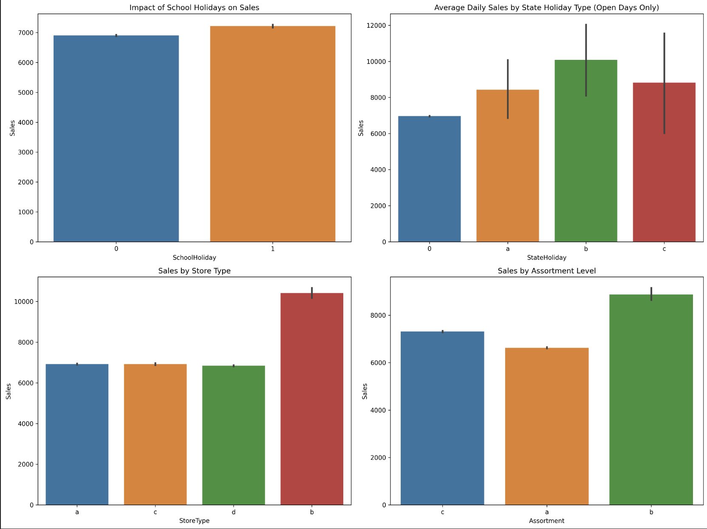
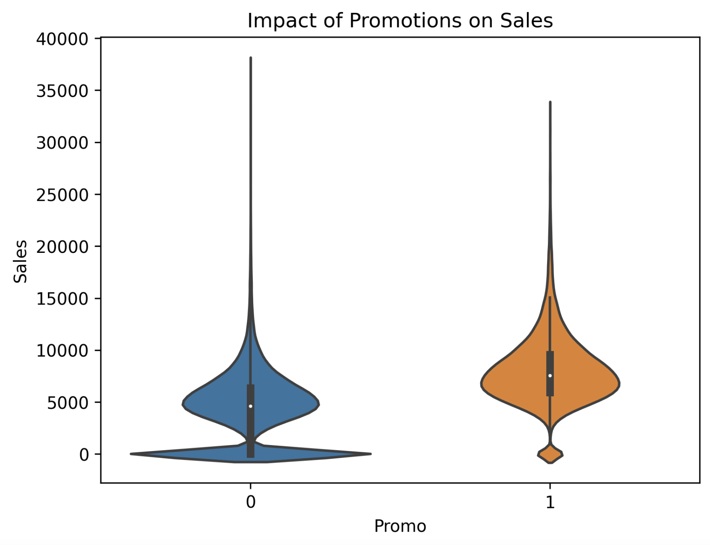
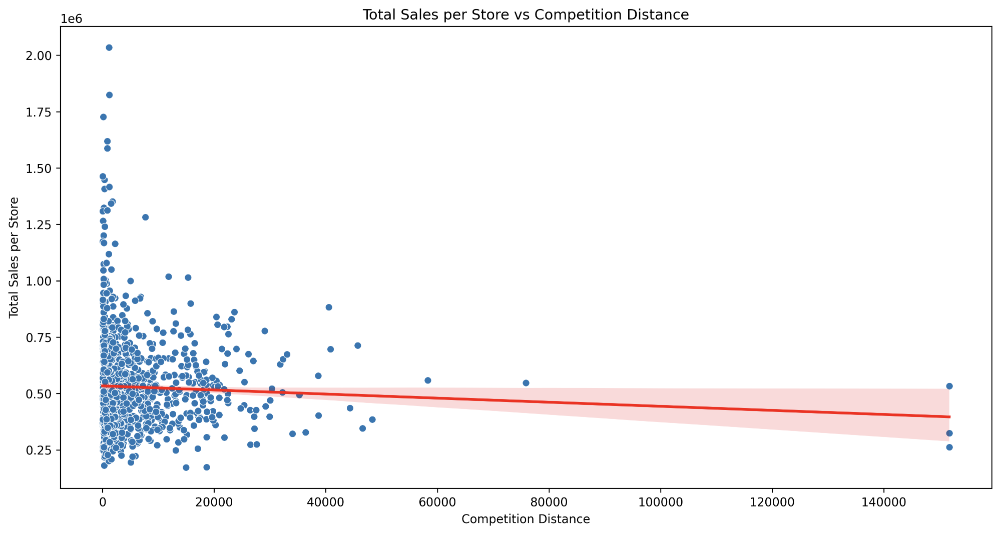
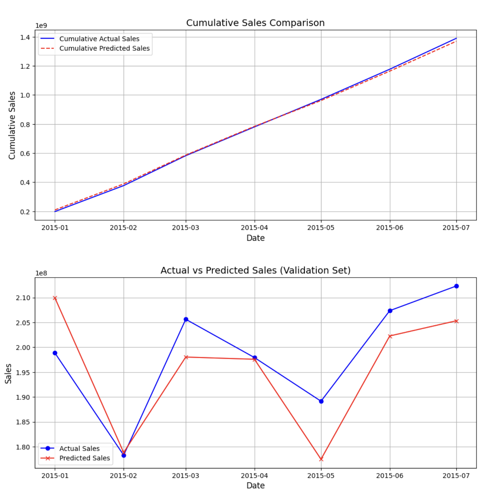
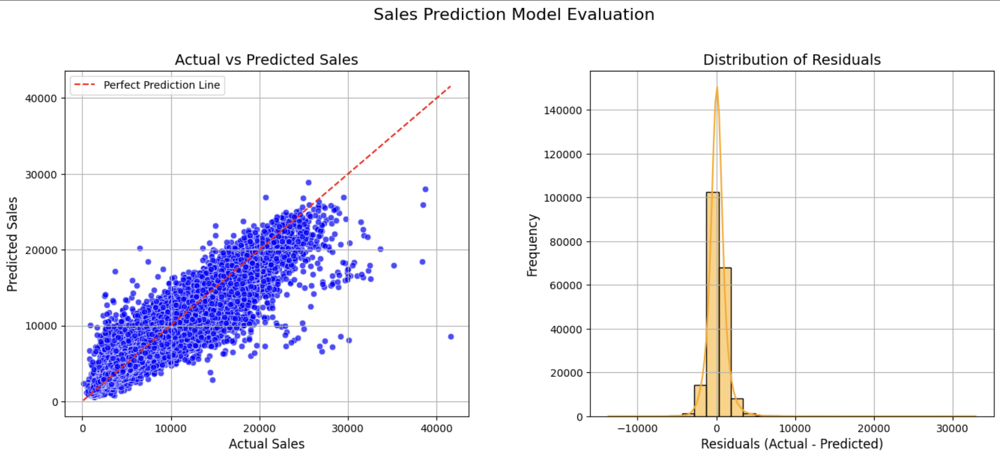

# Sales Forcasting - Rossmann Store

This project focuses on predicting future sales for Rossmann Stores using historical sales data. The dataset comprises historical sales data for 1,115 Rossmann stores, including additional contextual information such as promotions, holidays, and competition. TWe will use this data to build a robust forecasting model that provides accurate predictions of future 
sales allowing optimisations of resource allocation and operational planning.

The project is structured as follows:

* Exploratory Data Analysis (EDA): Uncover patterns and identify key factors that influence sales performance.
* Model Development and Optimization: Train and fine-tune machine learning models to accurately forecast future sales.
* Business Recommendations: Translate insights into practical strategies to improve sales outcomes.

#### How to View This Project 
This README contains an overview of a data analysis and sales forcasting project, full version and insights are withing the Jupyter Notebook

**To view it:** Open the notebook directly on GitHub (.ipynb file).

## Tools and Libraries Used 

- **Python Libraries:** Pandas, NumPy, Matplotlib, Seaborn, Sklearn
- **Models:** Linear Regression, XGBoost, Prophet
- **Environment:** Kaggle Notebook
  
This project utilized various Python libraries to handle data analysis and visualization efficiently. Pandas and NumPy were used for data manipulation and numerical computations, while Matplotlib and Seaborn helped create insightful visualizations. We will be using machine learning models **Linear Regression** and **XGBoost,** for predictive analysis, while **Prophet** was used for *time-series* forecasting, we will then compare the performance of these models and determine which provides the most accurate sales predictions.. All analysis was conducted in a Kaggle Notebook.

## Dataset

## Exploratory Data Analysis (EDA)
### Key takeaways:
1.	**Impact of Holidays on Sales:**
   
	•	Easter holidays(b) generate the highest daily sales, followed by public holidays(a) and Christmas(c).

2.	**Store Type and Assortment Influence:**
   
	•	Store type ‘b’ has nearly 50% higher sales than other types

	•	Stores with extra assortment generate the highest sales
 	

4.	**Promotions and Sales Variability:**
    
	•	Median sales nearly double during promotional periods

	•	Promotions lead to more consistent sales with less variance.

 	
 

5.	**Proximity to Competition:**
    
	•	Most stores are clustered close to the competition, highest and lowest performing stores

	•	This suggest that proximity to competition isn't necessarily bad for business
   	 

## Model Development

Linear Regression, XGBoost and Prophet were used for predicting future sales, this is how each model performed.

- **MAE(Mean Absolute Error)** indicates how far on average predictions are from the actual values.
- **RMSE(Root Mean Squared Error)** measures the square root of the average squared errors. It penalizes larger errors more heavily, making it sensitive to outliers.

| Model | MAE | RMSAE |
|----------|----------|----------|
| Linear Regression | 27.45%   |  37.55%   |
| Prophet | 42.20%   | 50.41%  |
| XGBoost | 11.03%   | 15.98%  |

Both of these measure error and deviation from actual values, therfore smaller numbers are better. XGBoost significantly outperforms other models with 11% MAE and 16% RMSAE on validation data.

### XGBoost Evaluation

The cumulative actual and predicted sales lines overlap closely, indicating that XGBoost accurately tracks long-term sales trends. Consistent alignment suggests that any monthly prediction errors (as seen in the bottom graph) do not compound significantly. Month to month trends  and directional changes are effectively captured by the model, even in months with greater variability.

The model shows a positive correlation with actual sales but has noticeable scatter, especially underpredicting high sales values. Residuals indicate accurate predictions for most cases, but with some significant misses and long tails. Overall, the model is reliable for average cases, struggles with extreme values, and has moderate prediction error, though it appears unbiased.

## Conclusion

### Model Accuracy

In conclusion, the XGBoost model significantly outperforms both Prophet and Linear Regression, achieving a strong 96% training accuracy and providing moderate forecasting error of approximately 11%. This indicates that the model effectively captures the patterns in the sales data and provides reliable predictions for future sales performance. Prophet, however, demonstrated the least accuracy, highlighting the importance of incorporating additional features beyond just time-based data for better forecasting.

### Business Recommendations

**Expansion Strategy**

* Focus new store openings in high-density areas, regardless of competition
* Convert more locations to store type 'b' format where feasible
* Expand product assortment across stores, prioritizing lower-performing locations

**Operational Optimization**

* Adjust staffing and inventory for Monday peaks
* Consider extending Sunday hours in high-traffic locations
* Implement broader product assortment in stores showing growth potential
  
**Promotion Strategy**

* More promotions in underperforming stores could lift sales
* Time major promotions with holiday periods, especially Easter
* Target promotions to counter slower sales days (Thursday-Saturday)
