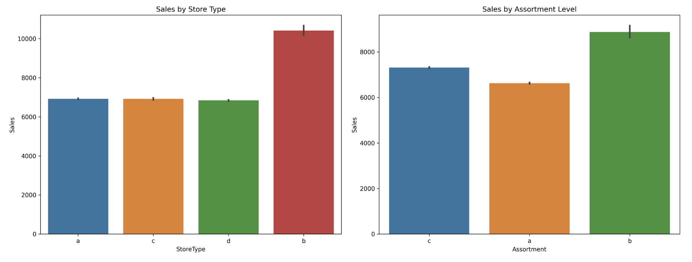
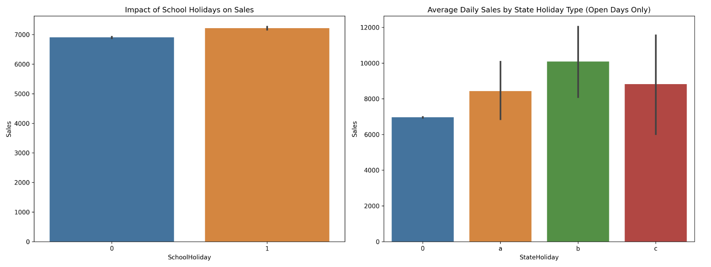

# Sales Forcasting - Rossmann Store

Rossmann is a leading drugstore chain with over 3,000 stores across Europe. Rossmann relies on accurate sales forecasting to optimize operations and enhance customer satisfaction. This project combines predictive modeling with data analysis to address sales challenges and uncover actionable insights.

The primary objectives are:
1.	**Forecasting Sales:** Develop machine learning models (Linear Regression, XGBoost, and Prophet) to predict six weeks of daily sales for 1,115 German stores, evaluated using MAE and RMSLE.
2.	**Uncovering Key Drivers of Sales:**** Analyze feature importance and correlations within the dataset to identify the factors most strongly associated with sales performance

Using historical sales and store data, the project will deliver forecasts and recommendations, enabling Rossmann to optimize promotions, resource allocation, and operational planning for improved sales performance.

#### How to View This Project 
This README contains an overview of a data analysis and sales forcasting project, full version and insights are withing the Jupyter Notebook

**To view it:** Open the notebook directly on GitHub (.ipynb file).

## Tools and Libraries Used 

- **Python Libraries:** Pandas, NumPy, Matplotlib, Seaborn, Sklearn
- **Models:** Linear Regression, XGBoost, Prophet
- **Environment:** Kaggle Notebook
  
This project utilized various Python libraries to handle data analysis and visualization efficiently. Pandas and NumPy were used for data manipulation and numerical computations, while Matplotlib and Seaborn helped create insightful visualizations. We will be using machine learning models **Linear Regression** and **XGBoost,** for predictive analysis, while **Prophet** was used for *time-series* forecasting, we will then compare the performance of these models and determine which provides the most accurate sales predictions.. All analysis was conducted in a Kaggle Notebook.

## Dataset

The Rossmann dataset comprises three tables that collectively provide data for sales forecasting:
1.	**Train Table:** The train table serves as the primary dataset for model training. It contains daily transaction records, including sales figures and other relevant features. This table consists of 1,017,209 records.
2.	**Test Table:** The test table includes transaction records similar to the train table but excludes the sales column. The task is to forecast the missing sales values for these records. This table contains 41,088 records.
3.	**Store Table:** The store table provides additional descriptive information about each store, such as location and characteristics. It can be joined with the train and test tables using the Store column. This table contains 1,115 records.

<table>
<tr>
<td width="33%">

### Test Data
| Column         | Data Type   |
|----------------|-------------|
| Id             | int64       |
| Store          | int64       |
| DayOfWeek      | int64       |
| Date           | object      |
| Open           | float64     |
| Promo          | int64       |
| StateHoliday   | object      |
| SchoolHoliday  | int64       |

</td>
<td width="33%">

### Train Data
| Column         | Data Type   |
|----------------|-------------|
| Store          | int64       |
| DayOfWeek      | int64       |
| Date           | object      |
| Sales          | int64       |
| Customers      | int64       |
| Open           | int64       |
| Promo          | int64       |
| StateHoliday   | object      |
| SchoolHoliday  | int64       |

</td>
<td width="33%">

### Store Data
| Column                     | Data Type   |
|---------------------------|-------------|
| Store                     | int64       |
| StoreType                 | object      |
| Assortment                | object      |
| CompetitionDistance       | float64     |
| CompetitionOpenSinceMonth | float64     |
| CompetitionOpenSinceYear  | float64     |
| Promo2                    | int64       |
| Promo2SinceWeek          | float64     |
| Promo2SinceYear          | float64     |
| PromoInterval            | object      |

</td>
</tr>
</table>

Before beggining analyisis, the dataset was cleaned and null values accounted for.

## Executive Summary

### Overview of Findings

Sales peak in **January,** driven by seasonality and holiday promotions, with a general upward trend despite fluctuations. Promotions significantly boost sales, increasing the median from 4,000–5,000 units during non-promotional periods to 7,000–8,000 units, while also reducing variance. **Store type** and **product assortment** have the largest impact on performance, with type ‘b’ stores and extra assortments generating the highest revenue.

These findings suggest that the main levers for boosting sales and driving growth are: promotions, expanding product assortments, and optimizing high-performing store types.

## Insights Deep Dive
### Store Performance & Location:

- **Competition proximity drives higher sales.** Stores located closer to competition (0-20,000 distance units) show the highest sales variance, with top performers reaching 2M units and lowest around 250K units, suggesting prime locations can support multiple stores.

- **Optimal market density supports growth.** The slight negative correlation between distance and sales suggests that being in high-density market areas outweighs competitive pressures, as evidenced by the clustering of high-performing stores in competitive zones.

- **Location strategy impacts revenue potential.** While distant stores (>100,000 units from competition) show consistent sales around 400-500K units, they lack the upside potential seen in competitive areas where top performers achieve 4-5x higher sales.
  
	

### Store Format & Assortment:
- **Type 'b' stores significantly outperform.** These stores average 10,000+ units in sales, nearly 50% higher than other store types which cluster around 6,500-7,000 units.
- **Extra assortment drives higher sales.** Stores with extra assortment (b) consistently outperform both extended (c) and basic (a) assortment levels, with sales approximately 30% higher than basic assortment stores.
- **Assortment level correlates with performance.** There's a clear hierarchy where expanding product range leads to higher sales, suggesting inventory diversity is a key growth lever.

	

### Promotional Impact:

- **Promotions drive 50%+ sales uplift.** Median sales during promotional periods reach 7,000-8,000 units compared to 4,000-5,000 units in non-promotional periods, demonstrating significant revenue impact.
- **Promotional periods show better consistency.** The tighter distribution in the violin plot during promotional periods (1) indicates more predictable sales outcomes compared to non-promotional periods.
- **Higher sales floor during promotions.** The minimum sales during promotional periods start at a higher baseline, suggesting promotions help maintain a more stable revenue stream.

	
  
### Seasonal & Holiday Effects:
- **January peaks dominate annual cycle.** The time series shows consistent January sales peaks reaching 8,500 units, likely driven by post-holiday promotions and seasonal shopping patterns.
- **Easter holiday premium.** Type 'b' state holidays (Easter) generate the highest daily sales averaging 10,000 units, outperforming both Christmas and public holidays.
- **School holidays show modest impact.** School holiday periods show only a slight sales increase of approximately 200 units (from ~6,900 to ~7,100), indicating limited direct influence on purchasing patterns.

	

## Model Development

Linear Regression, XGBoost and Prophet were used for predicting future sales, this is how each model performed.

- **MAE(Mean Absolute Error)** indicates how far on average predictions are from the actual values.
- **RMSE(Root Mean Squared Error)** measures the square root of the average squared errors. It penalizes larger errors more heavily, making it sensitive to outliers.

| Model | MAE | RMSAE |
|----------|----------|----------|
| Linear Regression | 27.45%   |  37.55%   |
| Prophet | 42.20%   | 50.41%  |
| XGBoost | 11.03%   | 15.98%  |

Both of these measure error and deviation from actual values, therfore smaller numbers are better. XGBoost significantly outperforms other models with 11% MAE and 16% RMSAE on validation data.

### XGBoost Evaluation

The cumulative actual and predicted sales lines overlap closely, indicating that XGBoost accurately tracks long-term sales trends. Consistent alignment suggests that any monthly prediction errors (as seen in the bottom graph) do not compound significantly. Month to month trends  and directional changes are effectively captured by the model, even in months with greater variability.

The model shows a positive correlation with actual sales but has noticeable scatter, especially underpredicting high sales values. Residuals indicate accurate predictions for most cases, but with some significant misses and long tails. Overall, the model is reliable for average cases, struggles with extreme values, and has moderate prediction error, though it appears unbiased.

## Conclusion

### Model Accuracy

In conclusion, the XGBoost model significantly outperforms both Prophet and Linear Regression, achieving a strong 96% training accuracy and providing moderate forecasting error of approximately 11%. This indicates that the model effectively captures the patterns in the sales data and provides reliable predictions for future sales performance. Prophet, however, demonstrated the least accuracy, highlighting the importance of incorporating additional features beyond just time-based data for better forecasting.

### Business Recommendations

**Expansion Strategy**

* Focus new store openings in high-density areas, regardless of competition
* Convert more locations to store type 'b' format where feasible
* Expand product assortment across stores, prioritizing lower-performing locations

**Operational Optimization**

* Adjust staffing and inventory for Monday peaks
* Consider extending Sunday hours in high-traffic locations
* Implement broader product assortment in stores showing growth potential
  
**Promotion Strategy**

* More promotions in underperforming stores could lift sales
* Time major promotions with holiday periods, especially Easter
* Target promotions to counter slower sales days (Thursday-Saturday)
